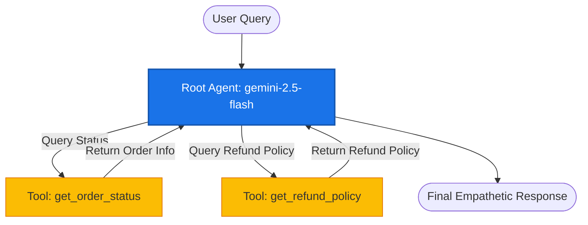
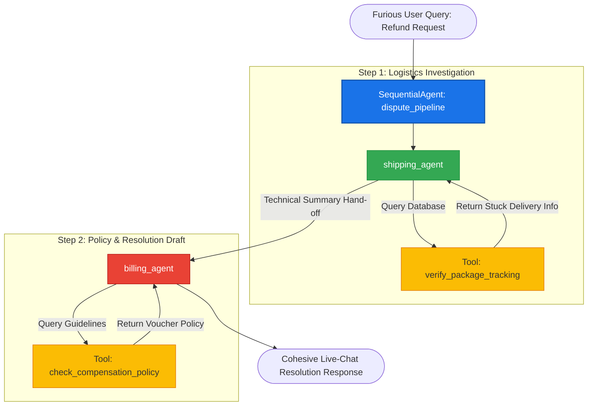

# Google ADK & LangSmith Integration Demo 🚀

Welcome to the **Google ADK & LangSmith Integration Demo** repository. This project demonstrates how to build and evaluate intelligent agents using the Google Agent Development Kit (ADK) and trace their executions seamlessly using **LangSmith**.

📖 **Read the Full Article:** This repository is the official codebase companion for the Medium article:
👉 **[Google ADK & LangSmith: Comparing AI Observability with Datadog and Google Native Tooling](https://medium.com/google-cloud/google-adk-langsmith-comparing-ai-observability-with-datadog-and-google-native-tooling-f1e96381bfb3)**

> [!NOTE]
> **Upcoming Roadmap:** In the near future, this repository will be updated with a demo showing how to capture and track **User/Human Feedback** (such as thumbs-up/thumbs-down signals) directly within LangSmith using the Google ADK. Stay tuned!

---

## ⚠️ IMPORTANT NOTE: Google ADK Version & Deprecation
> [!WARNING]
> The code in this repository is built using **Google ADK v1.0**. 
> 
> Please note that `SequentialAgent` is **deprecated** in **Google ADK v2.0**, which introduces graph-like workflows closer to LangGraph. This repository is intended as a demonstration of ADK v1.0 tracing integrations with LangSmith.

---

## 📂 Repository Structure

The project is organized into two primary customer support use cases along with standard Python environment configuration files:

```text
.
├── cust_support_basic/          # Use Case 1: Single-agent customer support
│   ├── agent.py                 # Core agent definition & tool functions
│   ├── README.md                # Detailed execution guide & trace examples
│   └── Langsmith_dashboard_screenshots/
├── cust_support_multiagent/     # Use Case 2: Multi-agent sequential dispute pipeline
│   ├── agent.py                 # Sequential dispute resolution pipeline
│   ├── README.md                # Detailed execution guide & multi-agent trace examples
│   └── Langsmith_dashboard_ss/
├── pyproject.toml               # Project dependencies and packaging metadata
├── uv.lock                      # Locked environment dependencies (uv lockfile)
└── README.md                    # Root documentation (this file)
```

---

## 🔍 What is LangSmith?

**LangSmith** is a developer platform designed for building, debugging, testing, evaluating, and monitoring LLM-powered applications. When building complex agentic systems, understanding what happens under the hood (e.g., system prompts, tools called, LLM outputs, latencies, and token usage) is critical.

LangSmith integrates with **Google ADK** to provide:
1. **Full Traceability**: Inspect every step in your agent's reasoning loop—from tool calls to sub-agent handoffs.
2. **Waterfall Analysis**: Visualize the exact latency and execution timeline of parallel or sequential tasks.
3. **Prompt & Tool Monitoring**: View the precise input prompts, system instructions, and tool arguments passed, as well as the exact raw outputs from Gemini.
4. **Metadata & Tagging**: Categorize your traces by environment, version, developer, and agent types for efficient filtering and search.
5. **PII Detection & Client-Side Masking**: Protect sensitive customer data (such as emails, SSNs, or payment details) using customizable SDK anonymizers or LLM Gateway redaction policies before traces leave your environment.
6. **Golden Dataset Creation**: Promote high-quality production runs and edge cases directly into versioned benchmark datasets for continuous evaluation.
7. **Human Feedback Loops**: Track user sentiment (e.g., thumbs-up/thumbs-down ratings) inline and route complex traces into annotation queues for expert review.
8. **Online & Offline Metrics Evaluation**: Monitor aggregated performance trends over time using automated evaluators (like LLM-as-a-judge for correctness and groundedness) combined with developer-defined scores.

---

## 🏗️ Use Case Architectures

This project implements two core customer support use cases.

### Use Case 1: Basic Support Agent (`cust_support_basic`)
A single-agent setup where a customer support representative uses integrated tools to answer user queries about order status and return/refund guidelines.



---

### Use Case 2: Multi-Agent Dispute Pipeline (`cust_support_multiagent`)
An automated order dispute resolution pipeline modeled as a **Sequential Agent** flow. It models a complex customer dispute where a package is late, shifting from hard logic (checking internal logistics) to soft empathetic policy enforcement.



---

## ⚙️ Installation & Project Setup

Follow these steps to set up and run the project locally.

### 1. Prerequisites
- **Python**: `>=3.13` (as defined in `pyproject.toml`)
- Recommended: [uv](https://github.com/astral-sh/uv) (fast Python package installer and resolver)

### 2. Dependency Installation
Initialize your virtual environment and install the required dependencies (`google-adk` and `langsmith[google-adk]`):

Using `uv`:
```bash
# Set up a virtual environment and install dependencies from pyproject.toml
uv sync
```

Using standard `pip`:
```bash
# Create a virtual environment
python -m venv .venv
# Activate it (Windows)
.venv\Scripts\activate
# Install the package dependencies
pip install -e .
```

### 3. Environment Configuration
Create a `.env` file in the subfolder of the usecase you are running, or in the root directory (the agent scripts load `.env` from their working directories). The `.env` file should contain the following variables:

```ini
# --- ADK SETUP ---
GOOGLE_GENAI_USE_VERTEXAI=0
GOOGLE_API_KEY=your_gemini_api_key_here

# --- LANGSMITH TRACING SETUP ---
LANGCHAIN_TRACING_V2=true
LANGCHAIN_ENDPOINT="https://api.smith.langchain.com"
LANGCHAIN_API_KEY=your_langsmith_api_key_here
LANGCHAIN_PROJECT=langsmith_adk
```

---

## 🚀 How to Run

### Use Case 1: Basic Support Agent
Run the single customer support agent:
```bash
# Using uv
uv run cust_support_basic/agent.py

# Using standard Python (with virtual env active)
python cust_support_basic/agent.py
```

### Use Case 2: Multi-Agent Dispute Pipeline
Run the sequential multi-agent system:
```bash
# Using uv
uv run cust_support_multiagent/agent.py

# Using standard Python (with virtual env active)
python cust_support_multiagent/agent.py
```

---

## 📊 Viewing LangSmith Traces
Once you run the agents, open your [LangSmith Dashboard](https://smith.langchain.com/). Under your project named `langsmith_adk`, you will see:
- Detailed runs for your agents and tool executions.
- Step-by-step latency analysis.
- Exact outputs and prompts sent to the `gemini-2.5-flash` model.

For more details on tracing outputs, please refer to the respective project READMEs:
- [Basic Support Agent README](./cust_support_basic/README.md)
- [Multi-Agent Dispute Pipeline README](./cust_support_multiagent/README.md)
