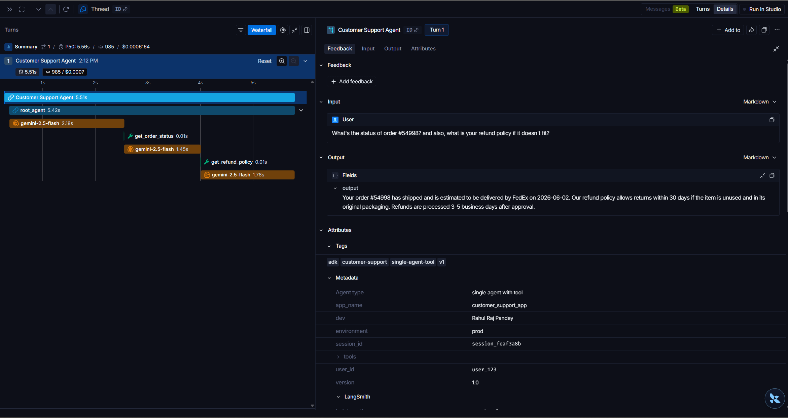

# Basic Customer Support Agent 📞

This directory contains the implementation of a single-agent customer support assistant. The assistant leverages the Gemini model via the Google Agent Development Kit (ADK) to answer common customer inquiries about order tracking and refund policies using specialized tools. All executions are traced and analyzed in real-time using LangSmith.

---

## ⚠️ IMPORTANT NOTE: Google ADK Version & Deprecation
> [!WARNING]
> The code in this directory is built using **Google ADK v1.0**. 
> 
> Please note that `SequentialAgent` is **deprecated** in **Google ADK v2.0**, which introduces graph-like workflows closer to LangGraph. This directory serves as a demonstration of ADK v1.0 tracing integrations.

---

## 🏗️ Architecture & How It Works

The basic support agent operates as a single reasoning loop that dynamically determines whether to call external tools based on the user's prompt.

1. **User Query**: The user asks a compound question: *"What's the status of order #XXXXX? and also, what is your refund policy if it doesn't fit?"*
2. **Model Call**: The agent (`gemini-2.5-flash`) parses the request and determines that it needs external data.
3. **Tool Execution**:
   - The agent calls `get_order_status` with the parsed order number.
   - The agent calls `get_refund_policy` to retrieve the return parameters.
4. **Final Response**: The agent synthesizes the tool outputs into a cohesive, concise, and polite response back to the customer.

---

## 🛠️ Tool Specifications

The agent is equipped with two Python tools:
- **`get_order_status(order_id: str)`**: Simulates an API call to a logistics system (e.g., FedEx) and returns order shipping status, estimated delivery date (dynamically calculated 3 days out), and carrier name.
- **`get_refund_policy()`**: Simulates a database query for company refund guidelines, returning policy windows (30 days) and acceptable product condition parameters.

---

## ⚙️ Tracing Configuration (LangSmith)

We configure the Google ADK to automatically trace all LLM and tool interactions to LangSmith via the `configure_google_adk` utility:

```python
configure_google_adk(
    name="Customer Support Agent",  # Trace Name in Dashboard
    project_name="langsmith_adk",   # Target project
    metadata={
        "environment": "prod", 
        "dev": "Rahul Raj Pandey",
        "version": "1.0",
        "tools": ["get_order_status", "get_refund_policy"], 
        "Agent type": "single agent with tool"
    },
    tags=["adk", "customer-support", "v1", "single-agent-tool"],
)
```

---

## 🚀 Setup & Execution

### 1. Configure Environment
Ensure your local `.env` file exists in this directory or the root directory:
```ini
GOOGLE_GENAI_USE_VERTEXAI=0
GOOGLE_API_KEY=your_gemini_api_key

LANGCHAIN_TRACING_V2=true
LANGCHAIN_ENDPOINT="https://api.smith.langchain.com"
LANGCHAIN_API_KEY=your_langsmith_api_key
LANGCHAIN_PROJECT=langsmith_adk
```

### 2. Run the Agent
Run the agent script using your terminal:

```bash
# Using uv (recommended)
uv run agent.py

# Using standard Python
python agent.py
```

---

## 📊 LangSmith Trace Analysis

With LangSmith enabled, every execution generates a comprehensive tree diagram representing the LLM decision-making process.

### Tracing Dashboard Overview
The main LangSmith interface displays high-level metrics for the run, including latency, cost, tags, and custom metadata:


*The dashboard displays our custom tags (`single-agent-tool`, `customer-support`) and metadata (`dev: Rahul Raj Pandey`, `version: 1.0`).*

### Waterfall Trace View
The waterfall view lets you inspect the sequential execution order and nested calls of the tools (`get_order_status` and `get_refund_policy`) alongside their precise execution times:



*The waterfall trace shows the parent agent call and the two nested, subsequent tool invocations executed to resolve the prompt.*
