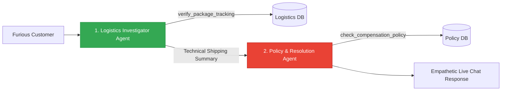
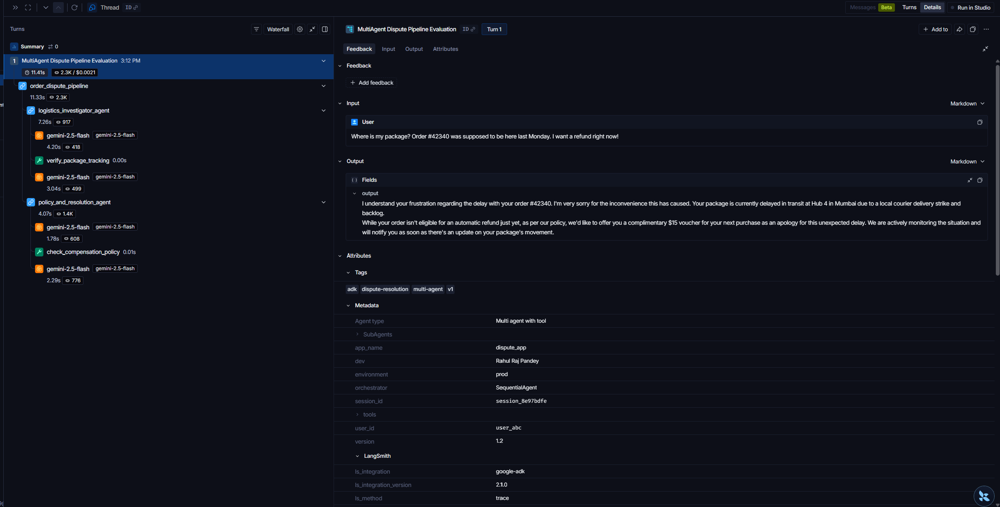
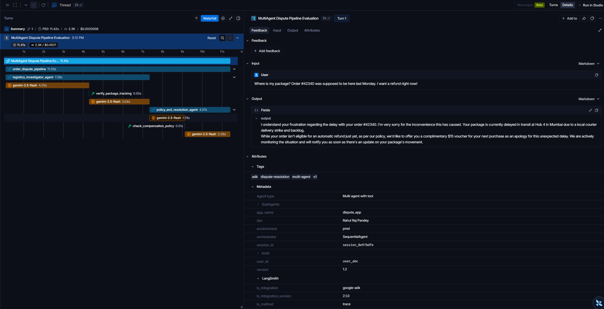

# Multi-Agent Dispute Resolution Pipeline 🤝

This directory contains an automated, multi-agent order dispute resolution pipeline. It demonstrates how complex customer customer-service workflows—which require transitioning from analytical investigations (querying logistics databases) to soft policy enforcement and copywriting (drafting empathetic compensation responses)—can be orchestrated using a sequential assembly line of specialized agents.

---

## ⚠️ IMPORTANT NOTE: Google ADK Version & Deprecation
> [!WARNING]
> The code in this directory is built using **Google ADK v1.0**. 
> 
> Please note that `SequentialAgent` is **deprecated** in **Google ADK v2.0**, which introduces graph-like workflows closer to LangGraph. This directory serves as a demonstration of ADK v1.0 tracing integrations.

---

## 🏗️ Use Case: Automated Order Dispute Resolution

### The Trigger Event
A customer contacts support, furious that their order is late, and demands an immediate refund:
> *"Where is my package? Order #48192 was supposed to be here last Monday. I want a refund right now!"*

### The Resolution Pipeline Flow
The dispute is resolved via a two-stage sequential pipeline orchestrated by a `SequentialAgent`:



#### Step 1: Logistics Investigation (`shipping_agent`)
- **Role**: Fact-finder. This sub-agent is instructed to perform technical checks and write a structured, objective summary of the shipment's status. It *does not* address the customer directly.
- **Tool**: `verify_package_tracking(order_id)` — Queries courier tracking logs. In our simulation, it discovers the package is **delayed in transit** due to a local courier delivery strike and is **5 days overdue**.

#### Step 2: Policy Compliance & Response Drafting (`billing_agent`)
- **Role**: Empathy & Policy Enforcement. This sub-agent reviews the technical summary from Step 1, checks policy, and drafts the final live-chat support message.
- **Tool**: `check_compensation_policy(days_overdue)` — Queries corporate guidelines. 
  - **Policy Rule**: Refund-eligible *only if* $\ge 7$ days overdue.
  - **Result**: At 5 days overdue, the customer is *not* eligible for a refund. However, they qualify for a **complimentary $15 voucher** for their next purchase.
- **Empathetic Live Chat**: The agent drafts a live chat response (no emails, no formal "Dear Customer", no signoffs) explaining the strike, offering the voucher, and keeping the tone supportive.

---

## ⚙️ Tracing Configuration (LangSmith)

Traces are configured using the `configure_google_adk` utility inside `agent.py`. The multi-agent tracing captures metadata detailing the pipeline's sub-agents:

```python
configure_google_adk(
    name="MultiAgent Dispute Pipeline Evaluation",
    metadata={
        "environment": "prod",
        "dev": "Rahul Raj Pandey",
        "version": "1.2",
        "orchestrator": "SequentialAgent",
        "tools": ["verify_package_tracking", "check_compensation_policy"],
        "SubAgents": ["shipping_agent", "billing_agent"],
        "Agent type": "Multi agent with tool",
    },
    tags=["adk", "multi-agent", "dispute-resolution", "v1"],
)
```

---

## 🚀 Setup & Execution

### 1. Configure Environment
Ensure your local `.env` file exists in this directory or the root directory:
```ini
GOOGLE_GENAI_USE_VERTEXAI=0
GOOGLE_API_KEY=your_gemini_api_key

LANGCHAIN_TRACING_V2=true
LANGCHAIN_ENDPOINT="https://api.smith.langchain.com"
LANGCHAIN_API_KEY=your_langsmith_api_key
LANGCHAIN_PROJECT=langsmith_adk
```

### 2. Run the Agent Pipeline
Run the multi-agent script using your terminal:

```bash
# Using uv (recommended)
uv run agent.py

# Using standard Python
python agent.py
```

---

## 📊 LangSmith Trace Analysis

Tracing multi-agent pipelines requires looking at hierarchical scopes. LangSmith automatically nests spans so you can see exactly which sub-agent called which tool.

### Tracing Dashboard Hierarchy
The LangSmith tree trace visualizes the parent `order_dispute_pipeline` run and shows the sequential execution of its children:



*The tracing tree clearly highlights the `shipping_agent` run (with its `verify_package_tracking` tool execution) and the subsequent `billing_agent` run (with its `check_compensation_policy` tool execution).*

### Multi-Agent Waterfall Trace View
The waterfall view maps out the latencies and execution timeline of the sub-agent handoffs:



*The waterfall representation allows you to isolate which agent took the longest to run and inspect individual input prompts, tool arguments, and raw Gemini generations for each step of the pipeline.*
